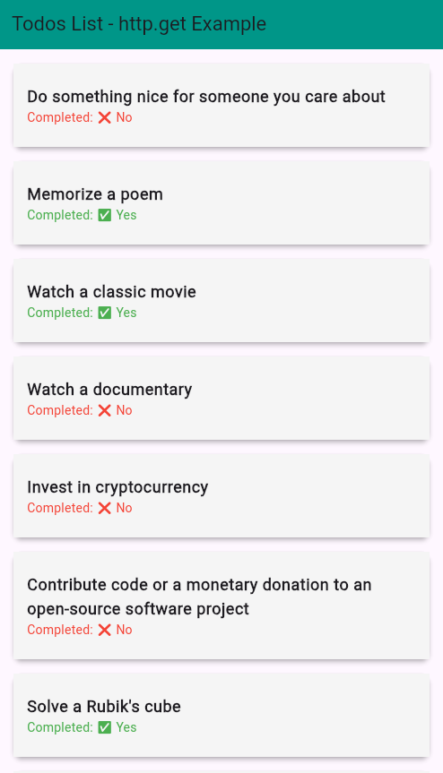

# Flutter HTTP GET Example

This project demonstrates how to make an **HTTP GET request** in Flutter using the `http` package. It fetches a list of todos from a public API and displays them in a **beautiful UI with Cards**.

## 🚀 Features

- Fetches data using **HTTP GET** request
- Displays data using **ListView\.builder**
- Uses **FutureBuilder** to handle asynchronous requests
- Shows **loading indicator** while fetching data
- Displays **error message** if API call fails

## 📦 Dependencies

Ensure you have the following dependencies in your `pubspec.yaml`:

```yaml
dependencies:
  flutter:
    sdk: flutter
  http: ^1.3.0 # Ensure you have the latest version
```

## 🛠 Setup & Usage

1. **Clone the repository**
   ```sh
   git clone https://github.com/azam-izm/flutter_apis.git
   cd flutter_apis/flutter_http_get_example
   ```
2. **Get dependencies**
   ```sh
   flutter pub get
   ```
3. **Run the app**
   ```sh
   flutter run
   ```

## 📌 API Used

This app fetches todos from **DummyJSON API**:

```
https://dummyjson.com/todos
```

## 📂 Project Structure

```
flutter_http_get_example/
│── lib/
│   ├── main.dart             # Entry point of the app
│   ├── http_get_example.dart # UI + API fetching logic
│   ├── todo_model.dart       # Model class for API response
│── pubspec.yaml              # Dependencies
```

## 🖼 Screenshot




## 🤝 Contributing

Feel free to submit issues or pull requests to improve this project!

## 📜 License

This project is open-source under the MIT License.

---

Happy coding! 🚀

