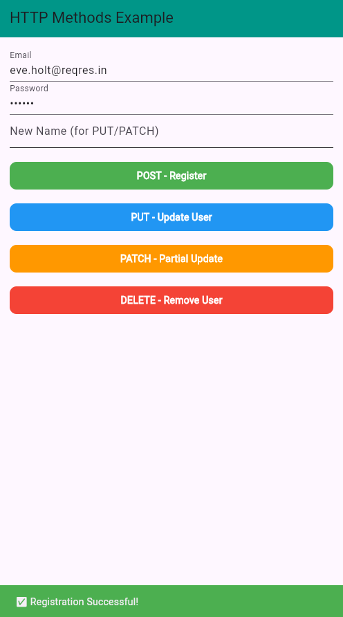

# 🚀 Flutter HTTP POST, PUT, PATCH, DELETE Example

A Flutter project demonstrating **HTTP methods** (`POST`, `PUT`, `PATCH`, `DELETE`) using the `http` package. This app allows users to **register, update, partially update, and delete** a user via API calls.

## 📌 Features  
✅ **POST** - Register a user with email & password.  
✅ **PUT** - Update the user's details completely.  
✅ **PATCH** - Partially update the user's name.  
✅ **DELETE** - Remove a user from the database.  
✅ **Error handling** - Catches network failures gracefully.  
✅ **Snackbar feedback** - Displays real-time response messages.  
✅ **Scrollable UI** - Uses `ListView` to prevent screen overflow.  

---

## 🔗 **API Endpoints Used**  

| HTTP Method | Endpoint                            | Description                         |
|------------|------------------------------------|-------------------------------------|
| **POST**   | `https://reqres.in/api/register`  | Registers a new user.               |
| **PUT**    | `https://reqres.in/api/users/2`   | Fully updates user details.         |
| **PATCH**  | `https://reqres.in/api/users/2`   | Partially updates the user's name.  |
| **DELETE** | `https://reqres.in/api/users/2`   | Deletes the user.                   |

---

## 📂 **Project Structure** 

```
flutter_http_post_put_patch_delete/
│── lib/
│   ├── main.dart                  # Entry point of the app
│   ├── http_methods_service.dart   # API requests & UI components
│── assets/
│   ├── screenshots/                # Folder for app screenshots
│── pubspec.yaml                    # Dependencies & package info
│── README.md                       # Project documentation
```


## 📸 **Screenshot**  

  

---

## 🛠 **Setup & Installation**  

### 1️⃣ **Clone the Repository**  
```sh
git clone https://github.com/azam-izm/flutter_http_post_put_patch_delete.git
cd flutter_http_post_put_patch_delete
